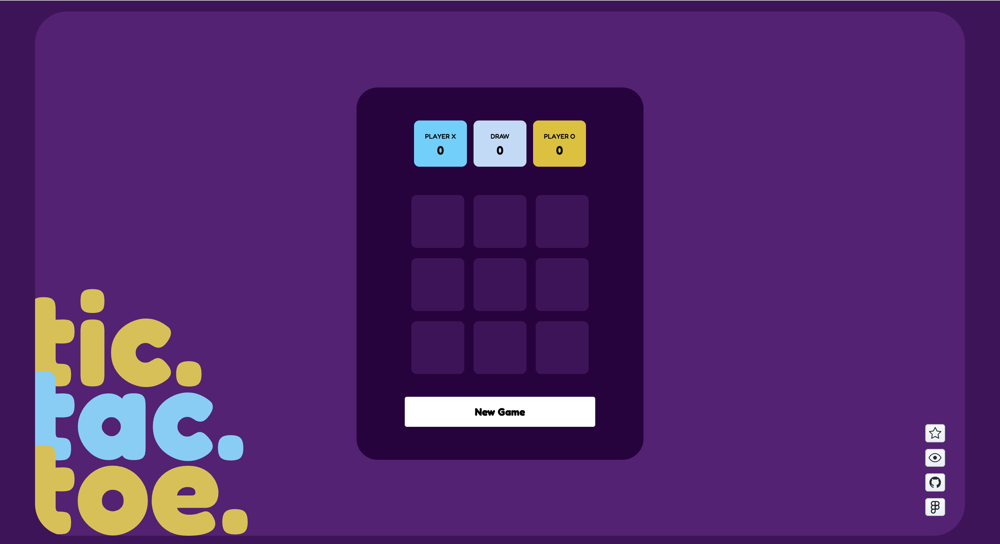
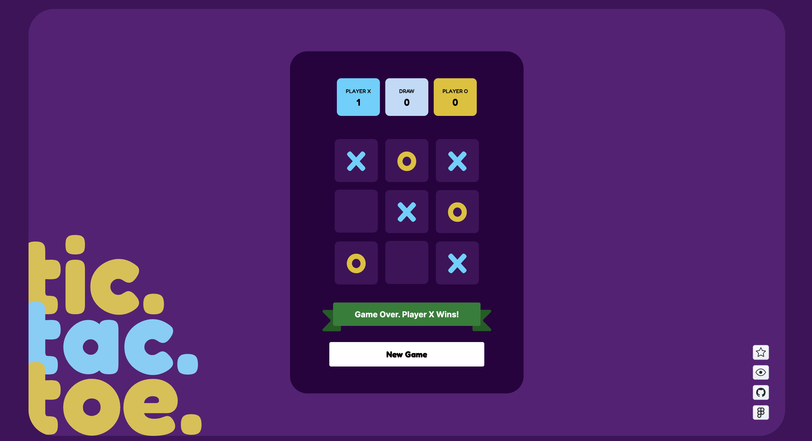
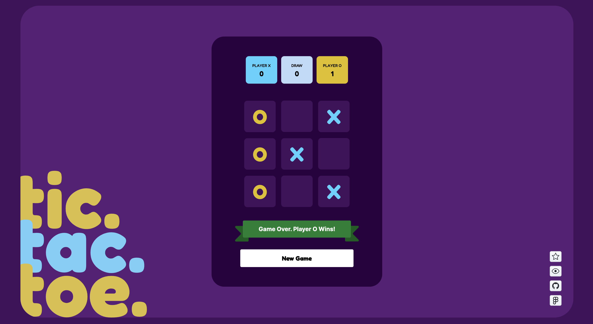
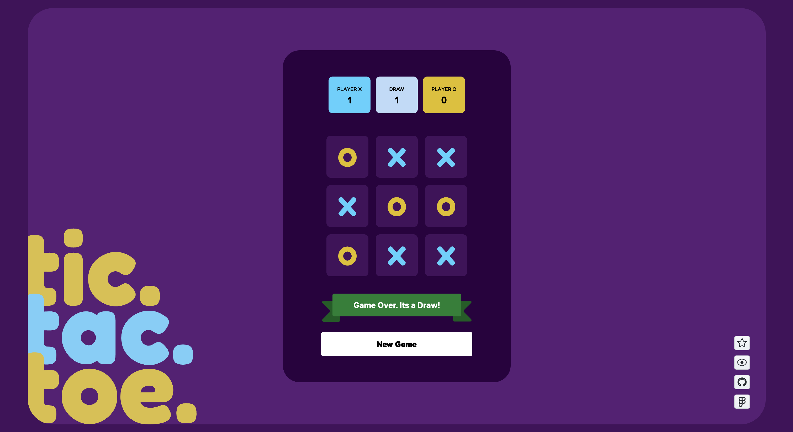

# Tic Tac Toe

The classic Tic Tac Toe game developed as a single page application using pure HTML5, SCSS, and TypeScript; Bundled with Vite and deployed on GitHub Pages.

<div align="center">

**[▶ Play it here][live-url]**

</div>

<div align="center">

![HTML][html-shield]
![SCSS][scss-shield]
![TypeScript][typescript-shield]
![JavaScript][javascript-shield]
![Vite][vite-shield]
![Visitors][visitors-shield]

</div>

Here are the screen previews:

<div align="center">


<p>Landing page</p>


<p>X Wins!</p>


<p>O Wins!</p>


<p>Game ends in a draw</p>

</div>

### Getting Started

```bash
npm install
npm run dev      # dev server
npm run build    # tsc + vite build
npm run preview  # serve the build
```

Pushes and merged PRs to `main` deploy automatically via GitHub Actions
to the `prod-vanilla-javascript` branch. `npm run deploy` is a manual fallback.

### Credits

Design based on [Figma design][figma-design-url] by [**@anuj_uchil**][anuj-uchil] 🙌🏻

### Author / Developer's Note

This project is a small exercise for me to build and deploy a single page application from scratch using Vite, HTML, TS, and SCSS only. This project introduced me to the following:
- [Vite][vite-url]'s brilliant bundling capability and blazing fast builds _(Of course this project's scope and scale is small but Vite's capabilities indeed look promising)_
- SCSS [7-in-1 Architecture][scss-7-in-1-architecture-url] _(I think it is really good from organizational point-of-view)_

### License

Distributed under the GNU GPL v3.0. See [LICENSE](LICENSE).

<div align="center">

<a href="https://github.com/DAShaikh10">![Built with love][built-with-love-badge]</a>

</div>

<!-- MARKDOWN -->

[anuj-uchil]: https://www.figma.com/@anuj_uchil
[built-with-love-badge]: https://forthebadge.com/badges/built-with-love.svg
[figma-design-url]: https://www.figma.com/community/file/1254192154560627135
[html-shield]: https://img.shields.io/badge/HTML-informational?style=flat&logo=html5&labelColor=white&color=e34f26
[javascript-shield]: https://img.shields.io/badge/JavaScript-informational?style=flat&logo=javascript&labelColor=black&color=f7df1e
[live-url]: https://dashaikh10.github.io/Tic-Tac-Toe/
[scss-7-in-1-architecture-url]: https://sass-guidelin.es/#architecture
[scss-shield]: https://img.shields.io/badge/SCSS-informational?style=flat&logo=sass&labelColor=white&color=cc6699
[typescript-shield]: https://img.shields.io/badge/TypeScript-informational?style=flat&logo=typescript&labelColor=white&color=3178c6
[visitors-shield]: https://visitor-badge.laobi.icu/badge?page_id=dashaikh10.tic-tac-toe
[vite-shield]: https://img.shields.io/badge/Vite-informational?style=flat&logo=vite&labelColor=white&color=9135ff
[vite-url]: https://vite.dev/
